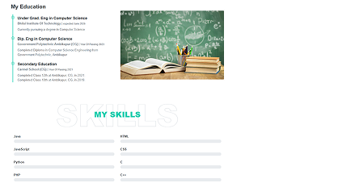

# 💻 CodSoft Web Development Internship Projects

This repository contains the frontend projects I completed during my 1-month Web Development Internship at **CodSoft**. The internship helped me gain hands-on experience in building responsive and interactive web interfaces using **HTML, CSS, and JavaScript**.

---

## 🚀 Projects Completed

### 🌐 1. Personal Portfolio Website
A sleek portfolio website to showcase my skills, projects, resume, and contact information.

**Features:**
- Clean modern UI
- About, Skills, Projects, and Contact sections
- Smooth scrolling and responsive design
- Mobile-friendly layout

**Preview:**  

  
  &nbsp;&nbsp;&nbsp;
  
  &nbsp;&nbsp;&nbsp;
  
  &nbsp;&nbsp;&nbsp;
  

---

### 📦 2. Product Landing Page
A stylish landing page for a hypothetical tech product.

**Features:**
- Eye-catching hero section
- Feature highlights with icons
- Call-to-action buttons
- Fully responsive

**Preview:**  

---

### 🧮 3. Calculator App
A functional and interactive calculator built purely using JavaScript.

**Features:**
- Perform basic arithmetic (add, subtract, multiply, divide)
- Clean interface
- Mobile responsive

**Preview:**  

---

## 🛠️ Tech Stack

- **HTML5** – Structure & content
- **CSS3** – Styling and layouts
- **JavaScript** – Interactivity and logic
- **VS Code** – Code editor
- **Git & GitHub** – Version control and hosting

---

